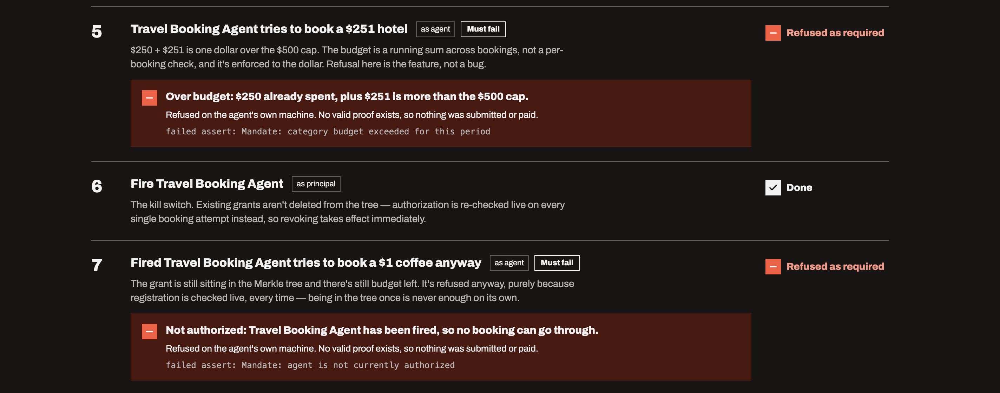

# Mandate

A privacy-preserving spending authorization for AI agents, written in Compact
on the Midnight Network. Built for Midnight's Buildathon (Akindo), targeting
Wave 2, Sep 27 - Oct 17 2026.

Mandate lets an AI agent prove it's authorized to spend, and within its
budget, without revealing who it works for or what the budget is for. An
agent that goes over its cap, or has been revoked, can't build a valid proof
at all, so the refusal happens on its own machine and nothing is submitted.

**Try it without a wallet:** [tomiin.github.io/midnight-mandate](https://tomiin.github.io/midnight-mandate/)
replays the real Preprod run, refusals included.

**Demo video (2 min, captions, recorded live on Preprod):** [youtu.be/tt_2N3Ekv6U](https://youtu.be/tt_2N3Ekv6U)

**Deck:** [docs/deck/Mandate-Wave2-deck.pdf](docs/deck/Mandate-Wave2-deck.pdf)



**Not hidden:** the cap, running totals and spend amounts are plain numbers on
the public ledger; they just aren't tied to anyone. See
[Honest limits](#honest-limits).

## Live on Preprod

| | |
|---|---|
| **Contract** | `5c7f2cc3e8d8bdc554ae3b3e5d65522705341e578c362da2261ab1c70f969757` |
| **Explorer** | [View contract](https://preprod.midnightexplorer.com/contracts/0x5c7f2cc3e8d8bdc554ae3b3e5d65522705341e578c362da2261ab1c70f969757) |
| **Deployed** | Sep 14, 2026, from the web UI in this repo |
| **Full run** | Sep 17, 2026: all 7 walkthrough steps behaved as designed (table below) |
| **Public ledger after the run** | 1 grant issued · 1 time exercised · period 1 · 0 active agents (1 revoked) |
| **Cascade backup** | Action `88119`, Lumera tx `7F689ADB…50176011`, block 6,674,184 ([verify](#verifying-the-cascade-backups-yourself)) |

| Step | Result |
|---|---|
| 1. Hire agent | done |
| 2. Set $500 travel budget | done |
| 3. Authorize | done |
| 4. Book flight, $250 | done |
| 5. Book hotel, $251 | **refused**: `category budget exceeded for this period` ($1 over) |
| 6. Fire agent | done |
| 7. Fired agent books $1 | **refused**: `agent is not currently authorized` |

"Times exercised" reads 1, not 3: the two refusals never reached the chain.

**Recorded run, Sep 30, 2026** (this is the one in the demo video): contract
`49ef1c9bec0a0e5e8ab6214184842ea15b6d68c50b6654d12e7ebedfc19d55b9`, same 7 steps,
same result: both refusals for their own reasons, and the ledger again reads
1 grant · 1 time exercised · period 1 · 0 active agents (1 revoked). Cascade
backup for this agent: action `88139`.

The first deployment, `cb02871d…528fab10` (deploy tx
`0x9de449e5…0a5bdb49`, block 2,551,824), is still on Preprod; the run above
used the newer contract.

Proving is wallet-delegated through the Midnight DApp Connector: the wallet
holds the keys and builds the proofs, and the app only reads public state
from the indexer. On Preprod today that still needs a local proof server,
because the remote one rejects proofs this size (see below).

## Running it

### What you need

| | |
|---|---|
| **A Midnight wallet** | Lace, or any wallet implementing the DApp Connector API. |
| **Set to Preprod** | The app requests `preprod`; a wallet on another network will refuse to connect and say so. |
| **Some tNIGHT** | It is never spent. It generates the DUST that pays fees. 1,000 tNIGHT is ample. |
| **A local proof server** | Required — see below. |
| **Node 22+ and Docker** | Node to run the app, Docker for the proof server. |

### The proof server requirement

Lace defaults its Proof Server setting to **Remote**
(`https://proof-server.preprod.midnight.network`). With that default, calling a
circuit fails: the server accepts `GET /version` and `POST /check`, then
returns **403 Forbidden** on `POST /prove`, served by `awselb/2.0` as HTML.
That is a load balancer rejecting the request before it reaches the prover —
most likely because the body is ~2.8 MB — not an error from the proving
service, and not something a DApp can work around.

Run a proof server locally instead. It reports version `8.1.0`, matching the
version Preprod's own remote prover reports, so there is no version skew:

```bash
docker run -d --name midnight-proof-server -p 6300:6300 \
  midnightntwrk/proof-server:8.1.0 -- midnight-proof-server -v

curl -sf http://localhost:6300/health    # {"status":"ok",...}
curl -sf http://localhost:6300/version   # 8.1.0
```

Then in Lace: **Settings → Midnight Settings → Proof Server → Local
(`http://localhost:6300`)**.

Proving happens entirely on your machine either way — the app never runs a
proof server of its own and never sees your keys. It delegates proving to the
wallet through the connector's `getProvingProvider`, so whichever prover you
configure is the one that runs.

### Start the app

```bash
npm install
npm run build -w mandate-contract     # builds the TypeScript witnesses
npm run build -w mandate-api
cd ui
npm run copy-contract-keys            # stages ZK assets into public/
npm run dev
```

Open `http://localhost:5173`, connect your wallet, then either **Deploy to
Preprod** for a contract you control, or paste an existing address to watch
one read-only.

### The walkthrough

Seven steps, run in order. Five are real transactions; steps 5 and 7 are
refusals that cost nothing, because the contract's asserts fire during local
circuit execution before a transaction is ever constructed.

| # | Step | Expected |
|---|---|---|
| 1 | Register the agent | on-chain |
| 2 | Set a 500 cap on a category | on-chain |
| 3 | Issue the authorization | on-chain |
| 4 | Agent spends 200 | on-chain, succeeds |
| 5 | Agent tries to spend 400 | **refused** — "category budget exceeded for this period" |
| 6 | Revoke the agent | on-chain |
| 7 | Revoked agent tries to spend 100 | **refused** — "agent is not currently authorized" |

Afterwards the public ledger reads `grants issued 1, times exercised 1`. The
two refusals left no trace, which is the point: enforcement happens before
anything is submitted or paid for.

Contract state is immutable and cumulative, so a second run on the same
contract no longer starts from zero. **Start fresh** deploys a new contract —
the only way to replay the sequence cleanly.

### Keep the contract address

The address is the only thing you need to keep. Everything a contract has
recorded — grants issued, exercises, budget periods, which agents are still
authorized — lives on-chain and can be read back by anyone holding it.

The app keeps a local list of contracts you have deployed or joined, and
remembers how far through the walkthrough you got on each one. That list is a
convenience stored in your browser. It is **not** where the data lives. Clear
your browser, switch machines, or use a different wallet, and you can paste
the address straight back in to reconnect — or open it on the
[explorer](https://preprod.midnightexplorer.com/) without any wallet at all.

Two things worth being precise about:

- **Anyone with the address can read the public counters.** That is by
  design, and it is the part that stays private that matters: the amounts,
  the limits, the agent identities and who transacted with whom are never
  published. See *What each party sees*.
- **Only the deploying wallet is the principal.** If you paste in a contract
  someone else deployed, you can watch its public state, but registering
  agents, setting limits, issuing grants and revoking will all be refused —
  correctly. Deploy your own to drive the full walkthrough.

### Running the tests

```bash
npm test -w mandate-contract   # 18 — contract behaviour, incl. adversarial cases
npm test -w mandate-ui         #  7 — wallet connection, provider assembly
cd policy && npm install && npm test   # 15 — policy-backup crypto
```

## Which address does Mandate use, and why?

Midnight separates three things most chains combine, and a wallet shows all
three. The app displays both addresses so this is never ambiguous.

| | What it is | What Mandate does with it |
|---|---|---|
| **Unshielded address** | Holds **NIGHT**. This is what a faucet sends to. | Nothing directly. NIGHT is never spent on fees. |
| **Shielded address** | Your **Zswap** identity (`CoinPublicKey` + `EncPublicKey`). | Supplied to the SDK because every contract transaction carries a Zswap component — but no shielded value ever moves. |
| **DUST** | A third token type of its own (`{ tag: 'dust' }`), with its own address and balance. | **This is what actually pays the fees.** |

**NIGHT is not the fee token — it is the asset that produces the fee token.**
From `@midnight-ntwrk/ledger-v8`: `DustParameters(nightDustRatio,
generationDecayRate, dustGracePeriodSeconds)` and `DustOutput { ...,
backingNight }`. NIGHT generates DUST continuously up to a cap, DUST decays,
and `feeToken()` returns a `DustTokenType`. Your NIGHT balance does not go
down when you transact.

**Why the shielded key is required even though nothing is shielded here.**
`WalletProvider` demands `getCoinPublicKey()` and `getEncryptionPublicKey()`,
and those are Zswap concepts — the connector only issues them from
`getShieldedAddresses()`. `getUnshieldedAddress()` returns an address and no
keys at all, so there is no unshielded substitute. Mandate supplies a Zswap
identity and then never uses it: grep the contract for `send`, `receive`,
`mint`, `coin`, `zswap` or `token` and you get nothing, and the deploy
transaction recorded **0 created outputs and 0 spent outputs**.

**Verifiable on our own deployment.** The deploy tx shows
`Transaction Fee: 1 SPECK` (1 tDUST = 10^15 SPECK), zero shielded outputs
either way, and one Dust Ledger Event. Fees came from DUST; nothing else
moved.

**A note on fee privacy.** `DustSpend` exposes only `vFee`, `oldNullifier`,
`newCommitment` and `proof` — no owner and no address — so paying a fee does
not publish which wallet paid it, and the explorer shows no sender on our
transaction. We have not established whether long chains of successor DUST
UTXOs are analytically linkable; that question is left open rather than
claimed either way.

## Test coverage

40 automated tests across three packages, all passing:

- **18** contract tests covering the adversarial cases, not just the happy
  path — a path lifted from someone else's grant is rejected, a request
  cannot be replayed, revocation is enforced at spend time rather than at
  issue time, agent and actor identifiers are domain-separated, and the
  budget is a summed cap rather than a fill count.
- **15** policy-backup crypto tests — deterministic key derivation, pinned
  domain tag, no plaintext leakage, fresh IV per encryption, and rejection
  of wrong keys, tampered ciphertext, tampered auth tags and swapped IVs.
- **7** UI tests covering wallet connection and provider assembly.

## The problem

Delegating a task to an AI agent today means one of three bad options: give
it a standing credential (unlimited blast radius if it's compromised or just
wrong), require your approval on every single action (which defeats the
point of delegating), or let whatever it transacts with keep a record of
everything it did on your behalf (a new surveillance log, one step removed
from you instead of on you).

Charles Hoskinson has made two separate, sourced points about this kind of
problem in 2026: that cloud AI platforms can expose people's unpublished
work and ideas once they're handed over (36crypto.com, reporting on his
researcher warning), and separately, at Consensus Miami, that privacy
becomes essential once AI agents start handling payments, commerce, and
decisions on someone's behalf (songmarketcap.com's Consensus Miami recap).
Mandate is aimed at the second point directly: let an agent prove it's
authorized to act, within a budget, without disclosing who it's acting for
or building a record of everything it's done.

## What this does

Mandate gets the enforcement without the record, using the same mechanism
[midnight-rxlimit](https://github.com/tomiin/midnight-rxlimit) already
proved out for cross-pharmacy prescription limits: a Merkle-committed grant,
a caller-bound proof of membership, and a nullifier for replay protection.

- A **principal** (you) registers an agent and grants it authorization to
  act in a specific category (e.g. "software purchases"), with a per-period
  dollar ceiling set for that category.
- The **agent** holds a secret key. It never registers its real identity
  anywhere; its on-chain presence is a one-way hash.
- Any **counterparty** (a merchant, an API, a service) can call `exercise()`
  to have the agent prove, in one proof: this agent is currently authorized
  by a real principal, for this category, and hasn't been revoked; this
  specific request hasn't been processed before; and its cumulative spend
  this period, plus this amount, doesn't exceed the category's cap.
- The counterparty gets a proof that the agent is authorized and within
  budget. It does not learn who the principal is, the agent's real
  identity, or what the category means. **The budget itself is not
  private:** the cap per category, the running total and each spend amount
  are plain numbers on the public ledger. What they can't be tied to is a
  person or company. Anyone watching the chain can also tell which of an
  agent's calls came from the same agent; see Honest limits.

## What each party sees

| Party | Learns |
|---|---|
| Principal | Nothing new about individual transactions. Writes a grant. |
| Agent | Its own authorizations. Holds one secret key. |
| Counterparty | "Valid, unspent request, within budget" — plus whatever the public ledger shows anyone (cap, running total, amount). Not who is behind the agent. |
| The chain | Opaque 32-byte values, a category, and a running total — including the agent's pseudonym on every call. |

## Two deliberate differences from RxLimit

RxLimit's design is right for prescriptions and wrong for this, in two
specific places — noted here rather than silently copied:

1. **The grant is not single-use.** A prescription is filled once, ever. An
   AI agent's budget authorization is meant to be drawn against repeatedly
   until the period's cap is hit. So `authorized` membership is a durable
   grant, checked on every call, not consumed. Replay protection instead
   applies to the individual **request** — a per-call id gets nullified, so
   the same specific purchase can't be double-processed, but the grant
   itself survives to be used again.
2. **Revocation is checked at spend time, not just issuance time.** RxLimit
   is explicit that a revoked prescriber can't write new scripts, but scripts
   already written stay valid — a real licence suspension. That's wrong for
   a compromised or misbehaving agent: you need to be able to cut it off
   immediately, mid-authorization. So `exercise()` re-checks the agent's
   active/revoked status every single call, not just at grant time.

Everything else — the leaf-binding fix, asserting `checkRoot` immediately
rather than storing and branching on it, and domain-separating every hash —
carries over from RxLimit unchanged, because those are proven, not
project-specific.

## Honest limits

Named here rather than left to be found, same as RxLimit and the earlier
health-access contract did.

- **An agent's calls are linkable to each other — across categories and
  across periods.** `exercise()` checks the agent is registered and not
  revoked with a lookup in the public `agents` map, and that lookup
  discloses the agent's pseudonym (`agentId`) on every call. An observer
  can't learn who the agent is in the real world, but can group all of its
  activity together. An earlier version of this README claimed spends were
  unlinkable across periods; that was wrong, and is corrected here. The
  per-period quota key is a second, narrower link on top of this, not the
  only one.
- **The same agent key is linkable across deployments.** `agentId` and the
  quota key are derived from the key and a domain tag, but not from the
  contract address, so one agent used with two Mandate contracts produces
  the same pseudonym in both.
- **The circuit names describe the app.** `registerAgent`, `revokeAgent`,
  `issueAuthorization`, `setCategoryLimit` and `exercise` are visible on
  chain, and together they tell anyone reading the contract that this is an
  agent-spending-authorization system. The contents stay private; the
  purpose doesn't.

  Why the pseudonym is public: revocation has to take effect immediately,
  mid-period, which means a live check against state the principal can
  update. Membership in `authorized` is already proven privately, but
  `authorized` is a `HistoricMerkleTree`, which by design accepts proofs
  against any earlier root — so removing a grant from it would not stop an
  agent presenting an older, still-valid proof. The public map was the
  straightforward way to get instant revocation, and it cost linkability.

  **Planned fix (not in this submission):** drop the public `agents` map
  and revoke inside the tree itself — blank the grant's leaf with
  `insertIndexDefault(index)`, then call `resetHistory()` so no earlier
  root containing it still validates. Order matters: resetting first and
  blanking second would leave the pre-revocation root valid. Honest agents
  are unaffected because their witness fetches a fresh path on every call.
  Alongside it, bind `agentId` and the quota key to the contract address.
  Both documented operations exist; neither has been compiled and executed
  in this contract yet, so this is a design, not a claim.
- **The budget is public.** The category, its cap, the running total and
  each spend amount are plain numbers on the ledger. Hiding them (storing
  commitments instead) is planned, not built.
- A compromised agent device can still spend within its remaining budget.
  No contract-level design fixes a device the attacker controls — the
  ceiling limits the damage, it doesn't prevent misuse entirely.
- The principal registry is the trust root. This contract enforces the
  budget; it doesn't verify the agent is a well-behaved AI, only that it's
  the one the principal actually authorized.
- **This is authorization-only. It does not move real value.** See below.
- Unaudited. It compiles (once verified) and the design is deliberate.
  That's not a security review.

## Why this doesn't move real money (yet)

The more impressive demo would have `exercise()` atomically move real token
value in the same call as the budget check — the money and the proof as one
unit. That's architecturally real: Compact's stdlib genuinely has
circuit-callable functions (`sendUnshielded`, `mintUnshieldedToken`,
`sendShielded`, `mintShieldedToken`) built on real ledger Kernel primitives,
confirmed by reading the actual compiler source, not recalled from memory.
Official example contracts already do this pattern.

But there's a live, currently open node bug —
[midnightntwrk/servicedesk#117](https://github.com/midnightntwrk/servicedesk/issues/117),
filed 2026-07-28, still in review, SLA already breached — where *any*
contract call carrying an unshielded-token effect gets rejected by the node
with `1010 Custom error: 231 (FeeCalculation OutsideTimeToDismiss)`, even a
single `receiveUnshielded` in a 7KB transaction. It was filed against
release-candidate software a full major version ahead of what
Preview/Preprod/Mainnet currently run, so it's unconfirmed whether it
affects the stack this project actually builds on — but betting a judged,
dated submission on an unverified assumption about someone else's unresolved
bug is the wrong risk. So: proof-only for this submission. The atomic
value-transfer version is the natural Wave 2-to-Wave-3 upgrade once this is
actually tested against the real deployed stack (there's a half-built probe
for exactly this in the `Privoice` repo).

## Verifying the Cascade backups yourself

Keplr's History tab shows "No recent transaction history" for this account
even though the transactions are on chain. That tab is a convenience view
backed by Keplr's own indexing and it does not surface Lumera's custom
action-module messages. Do not treat it as evidence either way — ask the
chain.

Run this from the repo root; it is read-only, needs no wallet and no keys:

```
node scripts/verify-onchain.mjs
```

It prints the account balance and every transaction the address has sent,
with block height, timestamp, result code and message type, plus the two
plain URLs it used so anything it says can be re-checked by hand in a
browser.

### What it showed at the time of writing

Three Cascade action registrations, all `code: 0` (success), all
`/lumera.action.v1.MsgRequestAction`:

| When (UTC) | Block | Transaction | Source |
|---|---|---|---|
| 2026-09-17 20:43:14 | 6674184 | `7F689ADBB4F59895F5092B7BAA8D888C0F5CCFAD514F5139752CBCE550176011` | the browser UI |
| 2026-09-14 04:38:42 | 6617738 | `D137B990925A32488014A1C4526D51AFB3918EA8EE6873C1A29EC08FECEFEC97` | `npm run upload-policy` |
| 2026-09-14 04:29:37 | 6617641 | `9B9368458A3CF047CC94D3D8BBF0B753BA81CA3148AF1CC767E8299F7711C017` | `npm run upload-policy` |

The first of those is Cascade action `88119` — the one the app reports in
its "Backed up" box after a browser upload. Its fee was real: the account
balance fell from 1,964,035 to 1,946,243 ulume across that transaction.

The two earlier rows are the same capability driven from the command line
before it was wired into the UI, which is why the CLI scripts in `policy/`
still exist and still work.

## Where Cascade fits (and where it doesn't)

Not the transaction flow — that stays record-free, the same as RxLimit's.
The legitimate gap: the principal's own policy (which agents, which
categories, which caps) needs to survive losing a device. On-chain, Mandate
only ever sees `agentId`/`grantLeaf`/category numbers — domain-separated
hashes with no human meaning outside the principal's own head. Cascade
(Lumera's decentralized permanent storage) backs up that mapping.

**Built, and usable two ways — from the app itself, or from the command line:**
- The policy document (agent labels, category meanings, caps) is encrypted
  client-side — AES-256-GCM, key derived by signing a fixed domain string
  (`"mandate:policy-key:v1"`) with the principal's own wallet via ADR-036
  `signArbitrary` and hashing the (deterministic) signature bytes. No
  separate secret to lose — anyone who can act as `principal` can
  re-derive the key; nobody else can.
- Uploaded to Cascade via the SDK's explicit 3-step flow (`prepareFile` ->
  `registerAction` -> `sendFileToSupernodes`) with `isPublic: true`.
  Privacy comes from our own encryption, not Cascade's storage-layer access
  control — deliberate, since the installed SDK's own `downloadPrivate()`
  documents itself as using "a simulated signature for `download_auth`"
  rather than a real one yet.
- **In the app**: the walkthrough's "Cascade backup" card encrypts the
  agent name and cap you typed and uploads them, signing with Keplr on
  lumera-testnet-2. It then keeps a local record of what was backed up and
  when, so it is obvious the job is already done, and warns if the agent,
  name or budget has changed since. **Verified live 2026-09-17** — Cascade
  action `88119`, on-chain transaction
  `7F689ADB…176011` in block `6674184`, `code: 0`, with a real fee paid.
  See "Verifying the Cascade backups yourself" above.
- **From the command line**: `npm run upload-policy` /
  `npm run download-policy` in `policy/` prove the full round trip:
  encrypt -> upload -> download -> decrypt -> same JSON back out.
  **Verified live on lumera-testnet-2, 2026-09-14** (action `88069`) — the
  recovered JSON matched byte-for-byte. The download half currently lives
  only here, which is why these scripts remain.
- **The round trip across both implementations is tested, not assumed.**
  Action `88119` was uploaded from the browser (Web Crypto API, key derived
  from a Keplr `signArbitrary` signature) and then recovered from the
  command line with `npm run download-policy -- 88119` (Node `node:crypto`,
  key derived from the mnemonic-based signer). It decrypted to exactly what
  went in:

  ```json
  { "version": 1, "agentName": "Travel Booking Agent", "category": 1,
    "categoryLabel": "travel", "capUnits": "500" }
  ```

  That is worth more than a format comparison: it shows the ADR-036 key
  derivation is stable across two entirely separate signing
  implementations. Keplr and the local CosmJS signer produce identical
  signature bytes for the fixed domain string, so both land on the same
  AES-256 key — the deterministic-signature property the scheme depends on,
  holding in practice.
- The two halves write the same payload shape — separate base64 `iv`,
  `ciphertext` and `authTag` fields — and differ only in plumbing: Node's
  `node:crypto` on the CLI, the Web Crypto API in the browser, because
  Node's AES-GCM authentication-tag calls are not implemented by the
  browser polyfill for `node:crypto`.
- The on-chain commitments (`authorized`, the Merkle tree of grants) stay
  the actual source of truth for what's enforceable. Cascade only backs up
  the human-readable map to what those hashes mean — losing it doesn't
  break the contract, it just means the principal can't explain what a
  hash was for anymore.

One real gap in the SDK, worth flagging rather than hiding: the npm-
published `@lumera-protocol/sdk-js@0.3.0` doesn't export a way to build a
signer from a plain Node.js mnemonic (`createProgrammaticSigner` exists in
the SDK's own unpublished main branch, not in the release actually
installed here) — `policy/src/wallets/programmatic.ts` is a local,
verified-against-source reimplementation of that same approach. See
BUILD-LOG.md for the full trail.

Dolos is not used here. It solves a different problem (Cardano-side data
observation for Midnight validators) with no bearing on this contract.
Mentioned only to say it was considered and correctly left out, not
forgotten.

## Circuits

Sizes as reported by the compiler, confirmed 2026-09-14. `k` is the
circuit-size parameter: a circuit has 2^k rows, and each +1 in k roughly
doubles proving time and memory — same convention RxLimit's README uses.

| Circuit | k | rows | Caller | Does |
|---|---|---|---|---|
| `exercise` | 15 | 21,709 | anyone (the counterparty) | The core proof: authorized, not revoked, request not replayed, within budget |
| `issueAuthorization` | 14 | 10,844 | principal | Grants a registered agent standing authorization in a category |
| `registerAgent` | 13 | 4,457 | principal | Marks an agent id active |
| `revokeAgent` | 13 | 4,457 | principal | Marks an agent id inactive — checked live at every `exercise()` |
| `setCategoryLimit` | 13 | 4,281 | principal | Sets the per-period spend ceiling for a category |
| `advancePeriod` | 13 | 4,244 | principal | Rolls the period forward; every quota resets |
| `isAgent` | 9 | 338 | anyone (read) | Whether an agent id is currently active |

`exercise` is the expensive one, same order of magnitude as RxLimit's
`dispense` (k=15, 23,475 rows) — expected, since it does the same class of
work (Merkle membership + nullifier + a quota check).

## Build

Compact toolchain pinned to match RxLimit's proven versions (see
BUILD-LOG.md for the reasoning):

```
cd contract
npm install
npm run compile      # compact compile +0.31.0 src/mandate.compact src/managed/mandate
npm test             # vitest, in-memory simulator, no infrastructure needed
```

**Compiled clean, first attempt — 7/7 circuits, 18/18 tests passing**
(2026-09-14, logged in full in BUILD-LOG.md).

## Credits

Mechanism (Merkle-committed grants, caller-bound leaf proofs, domain-separated
nullifiers, per-period quota keys) adapted directly from
[tomiin/midnight-rxlimit](https://github.com/tomiin/midnight-rxlimit),
which itself follows the Midnight contract examples' nullifier and
Merkle-membership patterns.

Licensed under Apache-2.0.
